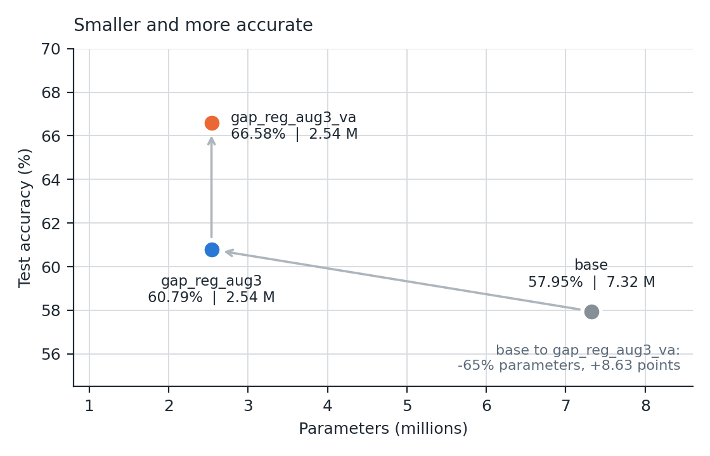
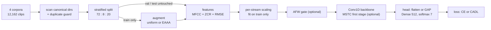
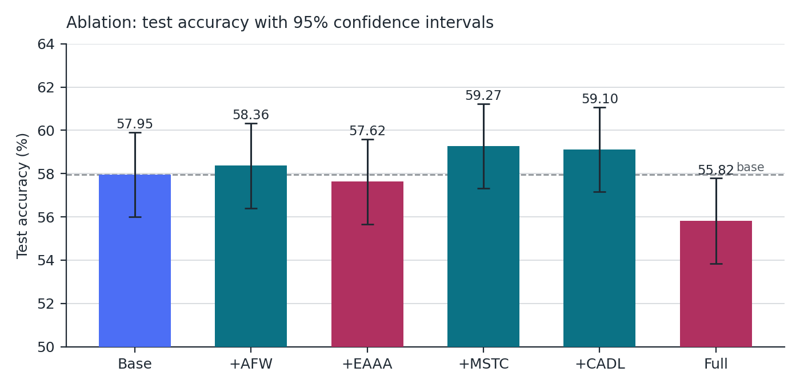
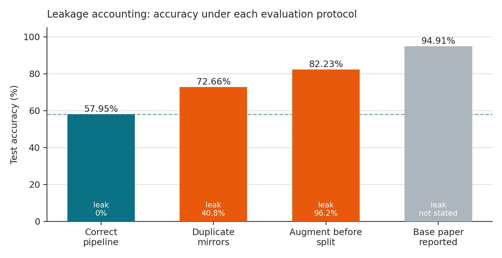
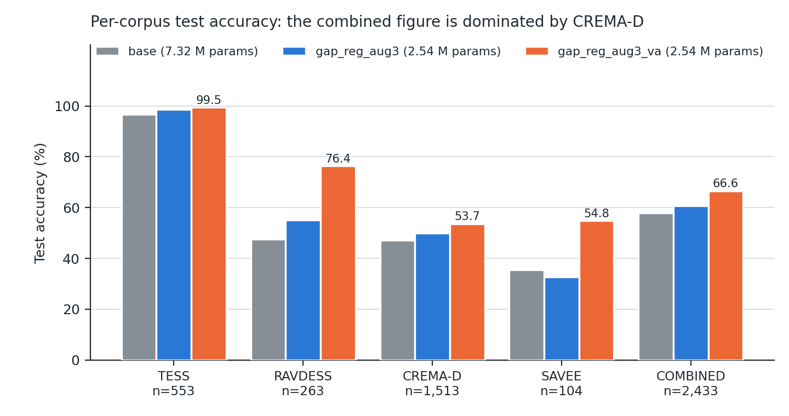
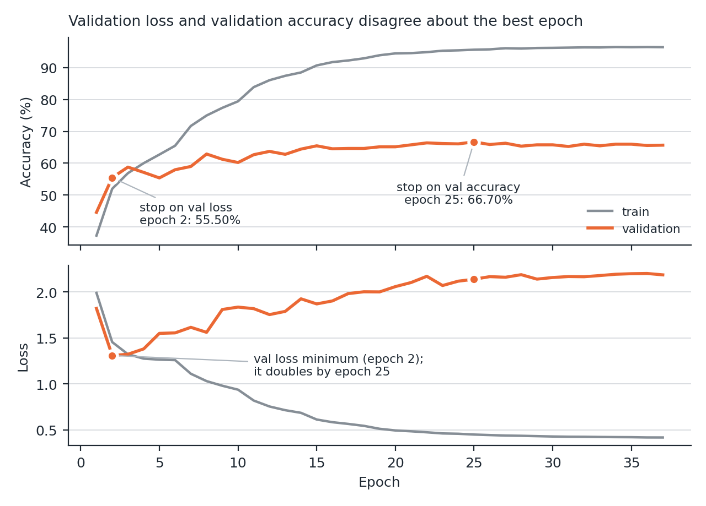
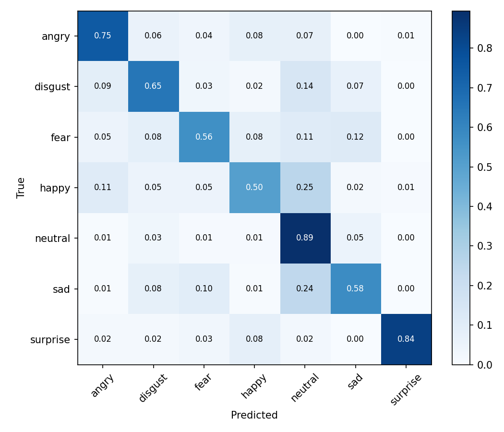
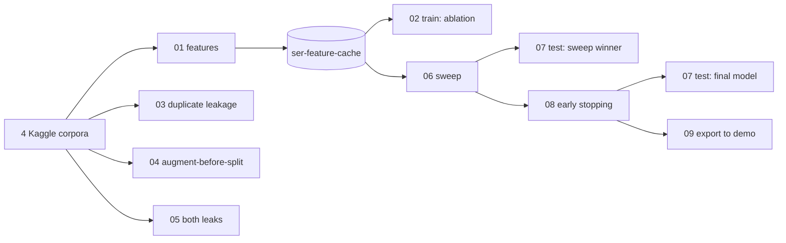

# Adaptive Feature-Weighted 1D-CNN with Emotion-Aware Augmentation for Robust Speech Emotion Recognition

A lightweight Conv1D speech-emotion-recognition (SER) system built on four
public corpora, extending a published 1D-CNN baseline with four novelties,
evaluated under a verified leakage-free protocol — and an investigation into
why the baseline's published 94.91% does not reproduce.

| | |
|---|---|
| **Task** | 7-class speech emotion recognition: angry, disgust, fear, happy, neutral, sad, surprise |
| **Data** | RAVDESS + TESS + SAVEE + CREMA-D, fused: **12,162 utterances** |
| **Base paper** | Chourasia, Lamba & Gupta (2026), *A 1D-CNN with advanced data augmentation for robust speech emotion recognition*, Scientific Reports — [doi:10.1038/s41598-026-56241-x](https://doi.org/10.1038/s41598-026-56241-x) |
| **Final model** | **66.58% test accuracy** (95% CI 64.71–68.46) with **2.54 M parameters** |
| **Principal finding** | Two measured data-leakage mechanisms inflate accuracy on this data by +14.71 and +24.27 points |
| **Full report** | [`docs/REPORT.md`](docs/REPORT.md) · [`docs/SER_Project_Report.pdf`](docs/SER_Project_Report.pdf) |
| **Kaggle notebooks** | [§8](#8-notebooks--every-kaggle-run) — every experiment is a notebook with a public run |

---

## Contents

1. [Overview](#1-overview)
2. [Headline results](#2-headline-results)
3. [Datasets](#3-datasets)
4. [Method](#4-method)
5. [How we built it](#5-how-we-built-it)
6. [Training and evaluation protocol](#6-training-and-evaluation-protocol)
7. [Experiments and results](#7-experiments-and-results)
8. [Notebooks — every Kaggle run](#8-notebooks--every-kaggle-run)
9. [Reproducing the work](#9-reproducing-the-work)
10. [Live demo](#10-live-demo)
11. [Repository layout](#11-repository-layout)
12. [Limitations and future work](#12-limitations-and-future-work)
13. [References](#13-references)

---

## 1. Overview

### What the project set out to do

The base paper fuses four emotional-speech corpora, extracts three
hand-crafted acoustic streams (MFCC, zero-crossing rate, RMS energy), and
classifies them with a five-stage Conv1D network, reporting **94.91%** test
accuracy. Its own future-work section notes that no component-wise ablation
was done. This project proposed four lightweight novelties, each aimed at a
specific limitation of the base design:

| # | Novelty | Limitation it targets | Where it acts | Cost |
|---|---|---|---|---|
| N1 | **AFW** — Adaptive Feature Weighting | the three streams are treated as equally important | feature fusion | +163 params |
| N2 | **EAAA** — Emotion-Aware Adaptive Augmentation | one augmentation policy for every emotion | training data | none at inference |
| N3 | **MSTC** — Multi-Scale Temporal Convolution | a single kernel size sees a single time scale | first conv stage | −4 params |
| N4 | **CADL** — Confusion-Aware Discriminative Loss | the loss ignores which emotions get confused | training objective | none at inference |

### What we actually found

1. **The published result does not reproduce.** Our verified
   reproduction of the base architecture — same split sizes, same class
   distribution, same parameter count — reaches **57.95%**, not 94.91%.
2. **Two leakage mechanisms explain most of the gap**, each predicted from
   first principles before being measured: duplicated dataset mirrors
   (**+14.71** points, 40.8% of the test set contaminated) and augmenting
   before splitting (**+24.27** points, 96.2% contaminated).
3. **The novelties help a little, none significantly.** MSTC (+1.32) and
   CADL (+1.15) are directionally positive; all six ablation intervals
   overlap at n = 2,433.
4. **The real gains came from elsewhere.** Replacing the oversized flatten
   head with global average pooling cut parameters by 65% at higher
   accuracy (60.79%), and selecting the training epoch by validation
   *accuracy* instead of validation *loss* lifted test accuracy to
   **66.58%** — the first statistically clear improvement in the study.
5. **Corpus composition matters as much as leakage.** The final model
   scores **99.46% on TESS** and **53.67% on CREMA-D**. A combined figure is
   mostly a CREMA-D figure.

---

## 2. Headline results

All numbers are on the held-out test set (n = 2,433), which each model saw
**exactly once**, after being selected on validation.

| Model | Accuracy | 95% CI | Macro F1 | MCC | AUC | Params |
|---|---|---|---|---|---|---|
| Base-paper reproduction | 57.95% | [55.99, 59.91] | 0.5995 | 0.5059 | 0.8932 | 7,324,295 |
| Best single novelty (+MSTC) | 59.27% | [57.32, 61.22] | 0.6087 | 0.5210 | 0.8971 | 7,324,291 |
| Pooling head + regularisation (`gap_reg_aug3`) | 60.79% | [58.85, 62.73] | 0.6271 | 0.5381 | 0.9063 | 2,540,167 |
| **Final: + early stopping on val accuracy (`gap_reg_aug3_va`)** | **66.58%** | **[64.71, 68.46]** | **0.6847** | **0.6118** | **0.9263** | **2,540,167** |
| *Base paper, as reported* | *94.91%* | — | *0.94* | *0.9294* | *0.9963* | *~7.19 M* |

<p align="center">
  
</p>

Against the closest comparable published result on the same four corpora
(Dasude et al., 2024: **50.6%**), the verified base is 7.4 points higher and
the final model 16.0 points higher.

---

## 3. Datasets

### Sources

The corpora are **not** redistributed in this repository (apart from 15
unmodified demo clips — see [§10](#10-live-demo)); download them from the
official sources or the Kaggle mirrors the notebooks use. Each corpus has its
own licence and citation requirements — check them at the source.

| Corpus | Used | Speakers | Official source | Kaggle mirror (used by the notebooks) |
|---|---|---|---|---|
| **RAVDESS** (speech, audio-only) | 1,440 | 24 actors | [Zenodo, doi:10.5281/zenodo.1188976](https://doi.org/10.5281/zenodo.1188976) | [uwrfkaggler/ravdess-emotional-speech-audio](https://www.kaggle.com/datasets/uwrfkaggler/ravdess-emotional-speech-audio) |
| **TESS** | 2,800 | 2 actresses | [Borealis, doi:10.5683/SP2/E8H2MF](https://doi.org/10.5683/SP2/E8H2MF) | [ejlok1/toronto-emotional-speech-set-tess](https://www.kaggle.com/datasets/ejlok1/toronto-emotional-speech-set-tess) |
| **SAVEE** | 480 | 4 male speakers | [University of Surrey](http://kahlan.eps.surrey.ac.uk/savee/) | [ejlok1/surrey-audiovisual-expressed-emotion-savee](https://www.kaggle.com/datasets/ejlok1/surrey-audiovisual-expressed-emotion-savee) |
| **CREMA-D** | 7,442 | 91 actors | [GitHub: CheyneyComputerScience/CREMA-D](https://github.com/CheyneyComputerScience/CREMA-D) | [ejlok1/cremad](https://www.kaggle.com/datasets/ejlok1/cremad) |
| **Total** | **12,162** | | | |

Project dataset on Kaggle: **[`macbot000/ser-feature-cache`](https://www.kaggle.com/datasets/macbot000/ser-feature-cache)**
— the pre-extracted feature matrices produced by notebook 01, so the GPU
notebooks never spend accelerator time on feature extraction.

### Labels

| Corpus | Filename convention | Label rule |
|---|---|---|
| RAVDESS | `03-01-06-01-02-01-12.wav` | 3rd field: `01` neutral, **`02` calm → neutral**, `03` happy, `04` sad, `05` angry, `06` fear, `07` disgust, `08` surprise |
| TESS | `OAF_back_angry.wav` | last `_` token; `ps` / `pleasant_surprise` → surprise |
| SAVEE | `DC_a01.wav` | leading letters: `a` `d` `f` `h` `n`, and **`sa` / `su` checked before single letters** |
| CREMA-D | `1001_DFA_ANG_XX.wav` | 3rd `_` token: `ANG DIS FEA HAP NEU SAD` (CREMA-D has **no surprise**) |

| Emotion | angry | disgust | fear | happy | neutral | sad | surprise |
|---|---|---|---|---|---|---|---|
| Utterances | 1,923 | 1,923 | 1,923 | 1,923 | 1,895 | 1,923 | **652** |

Split, stratified by emotion, seed 42, **before any augmentation**:
**train 8,756 / validation 973 / test 2,433** (72 : 8 : 20 — the base paper's
protocol).

> [!WARNING]
> **The RAVDESS and TESS Kaggle mirrors each contain the corpus twice.**
> RAVDESS ships both `Actor_01..24/` and `audio_speech_actors_01-24/`; TESS
> ships two directories that differ only in capitalisation. A naive recursive
> scan finds **16,402** files instead of 12,162, and a random split then puts
> byte-identical recordings on both sides of the train/test boundary.
> `data_loader.py` refuses to run on a duplicated scan, and the notebooks scan
> only these canonical subdirectories: `audio_speech_actors_01-24/`,
> `TESS Toronto emotional speech set data/`, `ALL/` (SAVEE), `AudioWAV/`
> (CREMA-D).

---

## 4. Method

### Pipeline



### Features

Each clip is resampled to 22,050 Hz; 0.6 s of leading silence is skipped and
2.5 s are kept (55,125 samples), peak-normalised, and zero-padded or
truncated. With a 2,048-sample frame and 512-sample hop this gives **108
frames**. Three streams are extracted with `librosa`:

| Stream | Per frame | Length |
|---|---|---|
| MFCC | 20 coefficients | 20 × 108 = 2,160 |
| ZCR — zero-crossing rate | 1 | 108 |
| RMSE — root-mean-square energy | 1 | 108 |
| **Fused input** | | **2,376** — exactly the base paper's `(2376, 1)` |

The streams are kept separate until the model, so AFW can weight them, and
each is standardised with its own scaler fitted on the training partition
only. Feature matrices are cached on disk under an MD5 fingerprint of the
item list and every feature setting, so re-runs are instant and any change
invalidates the cache.

### Architecture

| Block | Base paper (`base`) | Final model (`gap_reg_aug3_va`) |
|---|---|---|
| Input | 2,376 × 1 | 2,376 × 1 |
| Conv stages | 5 × (Conv1D k=5 → BatchNorm → MaxPool 2 → Dropout) with 512-512-256-256-128 filters | same |
| Conv dropout | 0.20 | 0.35 |
| Head | Flatten (9,472) → Dense 512 | **GlobalAveragePooling** → Dense 512 |
| Dense dropout | 0.30 | 0.55 |
| L2 weight decay | none | 1e-4 |
| Output | Dense 7, softmax | Dense 7, softmax |
| Parameters | **7,324,295** | **2,540,167** (−65%) |

The flatten head alone holds **4,850,176** parameters — 66% of the base
model — and contributes nothing measurable: swapping it for global average
pooling matches base accuracy with 65% fewer parameters (§7.4).

### The four novelties

- **AFW (N1).** Each stream is summarised by its mean and standard deviation;
  a 16-unit dense layer and a 3-way softmax produce per-sample stream weights,
  and each stream is rescaled by **3 × its weight**. The equal-weight solution
  (⅓, ⅓, ⅓) is therefore exactly the identity, so `base` vs `+AFW` is a
  clean comparison. The weights double as an interpretability output.
- **EAAA (N2).** Each training clip gets an augmentation matched to its
  emotion — pitch shift ±2 semitones (happy), time stretch 0.8–1.2× (sad),
  Gaussian noise (angry, neutral), time shift ± noise (fear), time shift
  (surprise), mild pitch shift + stretch (disgust) — instead of one of four
  techniques chosen uniformly at random. Augmentation never touches
  validation or test data.
- **MSTC (N3).** The first conv stage becomes three parallel branches with
  kernels 3, 5 and 7, splitting its 512-filter budget 172 / 170 / 170 so the
  parameter count is preserved (−4 parameters).
- **CADL (N4).** Focal cross-entropy (γ = 2) plus a pairwise penalty
  (λ = 0.5) that punishes probability assigned to the confusion partner of
  the true class, for the pairs sad↔neutral and angry↔fear. With both terms
  disabled it reduces *exactly* to categorical cross-entropy.

---

## 5. How we built it

**Specification first.** [`PROJECT_SPEC.md`](PROJECT_SPEC.md) holds the full
proposal (problem, literature survey, novelties, expected outcome) and an
implementation guide. The build was planned in
[`docs/superpowers/specs/`](docs/superpowers/specs/) and
[`docs/superpowers/plans/`](docs/superpowers/plans/) before code was written.

**Local code, cloud compute.** All source code is developed and tested
locally; all training runs on Kaggle (free P100/T4 GPUs), where every
notebook `git clone`s this repository so the code it runs is exactly what is
committed here.

**Every claim has a test.** The pytest suite (117 tests) needs no audio
download — label parsing depends only on filenames, and everything else uses
synthetic waveforms and a miniature four-corpus tree with the real naming
conventions. It passes on TensorFlow 2.15 / Keras 2 and TensorFlow 2.20 /
Keras 3.

| Test module | What it proves |
|---|---|
| `test_config.py` | the fused input length is exactly 2,376; class order; confusion-pair indices |
| `test_data_loader.py` | all four filename conventions, incl. SAVEE `sa`/`su` precedence and RAVDESS calm→neutral |
| `test_no_duplicates.py` | the duplicate guard fires on the real 16,402-path Kaggle listings; canonical dirs sum to 12,162 |
| `test_split.py` | 72:8:20 ratios, stratification, **zero** train/test path overlap |
| `test_augmentation.py` | EAAA applies the per-class policy; reproducibility; length restored after stretching |
| `test_features.py` | stream shapes; cache fingerprint invalidation |
| `test_model.py` | AFW weights are a distribution and the uniform solution is the identity; **MSTC is parameter-neutral** |
| `test_losses.py` | **CADL ≡ cross-entropy** when both terms are off |
| `test_report.py` | results aggregation and acceptance checks |
| `test_train_integration.py` | the saved checkpoint reproduces the reported metrics end to end |

**Bugs the process caught** (each fixed in its own commit):

- *Checkpoint/metrics mismatch.* `ModelCheckpoint` and `EarlyStopping`
  monitored different quantities, and Keras only restores best weights when
  early stopping actually fires — so a run that finished all its epochs
  reported metrics for a different model than the one it saved. The pipeline
  now reloads the checkpoint explicitly before evaluating.
- *Duplicate-mirror contamination* (the warning in §3) — now a hard error.
- *Keras 3 compatibility.* The AFW layer needed an explicit `build()` so its
  sub-layers exist when a saved model is reloaded under Keras 3.
- *Kaggle mount layouts.* Dataset paths are discovered by walking
  `/kaggle/input` rather than hard-coded, and the feature-cache fingerprint
  depends on absolute paths, so every notebook pins the same data root and
  asserts a cache hit before using GPU time.

**Shipping the model.** Kaggle trains under Keras 3; this repository pins
Keras 2.15. A Keras 3 `.keras` file cannot be read by Keras 2, so notebook 09
exports the weights and scaler statistics as plain numpy arrays, which
`demo/` loads into the architecture `model.py` rebuilds. Locally the export
reproduces Kaggle's predictions to within 2e-08 and the final test accuracy
exactly (1,620 / 2,433).

---

## 6. Training and evaluation protocol

| Setting | Value |
|---|---|
| Optimiser | Adam, learning rate 1e-3 |
| Batch size / max epochs | 32 / 50 |
| Early stopping | on validation **loss**, patience 10 — except the final model: validation **accuracy**, patience 12 |
| LR schedule | ReduceLROnPlateau on validation loss, factor 0.5, patience 4, floor 1e-6 |
| Training-set size | 11,700 after augmentation (1.34×), or 26,268 for the 3× runs |
| Seed | 42 everywhere |
| Hardware | Kaggle NVIDIA P100 (ablation, sweep) and T4 (early-stopping study) |

**The test set is sealed.** Every candidate is compared on the validation
split; only the winner is evaluated on the test set, once, in a separate run.
This rule is what makes the 66.58% honest — and the validation estimate held
up (66.70% on validation, 66.58% on test).

**Metrics.** Accuracy with a normal-approximation 95% confidence interval
(about ±2 points at n = 2,433), per-class and macro precision / recall / F1,
specificity, G-mean, Matthews correlation, Cohen's kappa, macro one-vs-rest
AUC, confusion matrices, and error counts on the two CADL pairs.

---

## 7. Experiments and results

### 7.1 Ablation — the four novelties

Each novelty added alone to the base, then all four together. Test set,
n = 2,433.

| Configuration | Accuracy | 95% CI | Macro F1 | MCC | Kappa | AUC | Params |
|---|---|---|---|---|---|---|---|
| Base (reproduction) | 57.95% | [55.99, 59.91] | 0.5995 | 0.5059 | 0.5040 | 0.8932 | 7,324,295 |
| + AFW (N1) | 58.36% | [56.41, 60.32] | 0.5929 | 0.5103 | 0.5078 | 0.8908 | 7,324,458 |
| + EAAA (N2) | 57.62% | [55.66, 59.59] | 0.5944 | 0.5017 | 0.4993 | 0.8903 | 7,324,295 |
| + MSTC (N3) | 59.27% | [57.32, 61.22] | 0.6087 | 0.5210 | 0.5192 | 0.8971 | 7,324,291 |
| + CADL (N4) | 59.10% | [57.15, 61.06] | 0.6038 | 0.5185 | 0.5168 | 0.8888 | 7,324,295 |
| Full (all four) | 55.82% | [53.84, 57.79] | 0.5695 | 0.4825 | 0.4782 | 0.8810 | 7,324,454 |

<p align="center">
  
</p>

All six intervals overlap, so **no single novelty is a significant gain** at
this sample size. MSTC and CADL are directionally positive across every
metric; EAAA slightly hurts; combining all four is the weakest configuration.
On the confusion pairs CADL targets, CADL cuts errors from 188 to 172 — but
AFW, not designed for it, cuts them further, to 153:

| Configuration | sad↔neutral | angry↔fear | Total |
|---|---|---|---|
| Base | 124 | 64 | 188 |
| + AFW | 114 | 39 | **153** |
| + EAAA | 128 | 34 | 162 |
| + MSTC | 135 | 49 | 184 |
| + CADL | 130 | 42 | 172 |
| Full | 98 | 61 | 159 |

The AFW gate learns to down-weight MFCC relative to ZCR and RMSE (≈0.28 vs
≈0.35 vs ≈0.37), but the spread across emotions is only ~0.02 — a global
rebalancing rather than per-emotion specialisation.

### 7.2 Reproducibility investigation — where 94.91% comes from

Two controlled experiments, each changing exactly one thing against the
verified base pipeline.

| Pipeline | Rows | Test contamination | Accuracy | Δ |
|---|---|---|---|---|
| **Correct: split, then augment** | 12,162 | 0% | **57.95%** | — |
| Duplicate dataset mirrors | 16,402 | 40.8% (1,339 / 3,281) | 72.66% | +14.71 |
| Augment, then split | 36,486 | 96.2% (7,019 / 7,298) | 82.23% | +24.27 |
| *Base paper, reported* | *12,162* | *not stated* | *94.91%* | *+36.96* |

<p align="center">
  
</p>

Both contamination rates were **predicted before measurement** — 41% for the
mirrors (byte-identical twins split across the boundary with probability
2 × 0.2 × 0.8), 96% for augment-then-split (1 − 0.2² with three rows per
utterance) — and measured within 0.2 points. Neither mechanism alone reaches
94.91%, but they are independent and compound; treating them as
multiplicative on the error rate gives roughly 88%. Notebook 05, which
measures both together, is written but has not yet been run.

### 7.3 Corpus composition

The final model's accuracy by corpus:

| Corpus | Test clips | Base | `gap_reg_aug3` | **Final** |
|---|---|---|---|---|
| TESS | 553 | 96.75% | 98.55% | **99.46%** |
| RAVDESS | 263 | 47.53% | 55.13% | **76.43%** |
| CREMA-D | 1,513 | 47.12% | 49.90% | **53.67%** |
| SAVEE | 104 | 35.58% | 32.69% | **54.81%** |
| **Combined** | 2,433 | 57.95% | 60.79% | **66.58%** |

<p align="center">
  
</p>

TESS is two speakers in a studio with deliberately stereotyped delivery, and
the utterance-level split puts the same speakers in training and test.
CREMA-D is 91 crowd-sourced actors with natural delivery, and 62% of the
test set. **One model, 99.5% on TESS and 53.7% on CREMA-D**: an SER accuracy
quoted without its corpus composition says very little.

### 7.4 Efficiency study — regularisation sweep

The base run reaches 98.9% train vs 61.8% validation accuracy by epoch 14,
which looked like severe overfitting. Six candidates, novelties off, scored
on **validation only**:

| Candidate | What changes | Val accuracy | Params | Δ vs base |
|---|---|---|---|---|
| **`gap_reg_aug3`** | GAP head + dropout 0.35/0.55 + L2 1e-4 + 3× augmentation | **60.84%** | 2,540,167 | **+2.26** |
| `gap_reg` | GAP head + dropout + L2 | 60.33% | 2,540,167 | +1.75 |
| `reg` | dropout + L2 | 59.40% | 7,324,295 | +0.82 |
| `gap` | GAP head only | 58.79% | 2,540,167 | +0.21 |
| `base` | — | 58.58% | 7,324,295 | — |
| `gap_reg_aug3_lr` | `gap_reg_aug3` at lr 5e-4 | 58.58% | 2,540,167 | +0.00 |

The gain was far smaller than expected, and the reason corrected the
diagnosis: the 37-point gap is at epoch 14, but early stopping restores
epoch 4, where the gap is only 4.7 points. Early stopping was already doing
the regularising. The winner tested at **60.79%** with 65% fewer parameters.

### 7.5 Early-stopping criterion — the largest single gain

In the base run's history, validation **loss** is lowest at epoch 4 (58.58%
validation accuracy) but validation **accuracy** keeps rising to 61.87% at
epoch 13: cross-entropy punishes growing over-confidence even while the
predictions keep improving. Notebook 08 repeated two models with one change
— stop and select on validation accuracy:

| Configuration | Stops on | Val accuracy | Best epoch | Val loss | Train–val gap |
|---|---|---|---|---|---|
| `base` | val loss | 58.58% | 4 of 14 | 1.114 | 4.7 pts |
| `base_va` | val accuracy | 63.72% | 31 of 43 | 1.596 | 36.2 pts |
| `gap_reg_aug3` | val loss | 60.84% | 5 of 17 | 1.364 | 1.7 pts |
| **`gap_reg_aug3_va`** | val accuracy | **66.70%** | 25 of 37 | 2.139 | 28.9 pts |

<p align="center">
  
</p>

The winner was tested once: **66.58%** [64.71, 68.46], +5.80 over
`gap_reg_aug3` with non-overlapping intervals. Two costs come with it, and
both are reported:

- **Over-prediction of neutral.** Neutral recall rises from 0.596 to 0.894
  while its precision falls from 0.640 to 0.518; sad↔neutral errors rise from
  86 to 112 (angry↔fear fall from 51 to 34).
- **Over-confident probabilities.** Validation loss at the chosen epoch is
  2.14 against 1.36 — the model ranks emotions better, but its softmax
  outputs should not be read as calibrated confidence.

### 7.6 The final model in detail

Per class, test set:

| Emotion | Precision | Recall | F1 | Support |
|---|---|---|---|---|
| angry | 0.741 | 0.751 | 0.746 | 385 |
| disgust | 0.681 | 0.651 | 0.666 | 384 |
| fear | 0.705 | 0.564 | 0.626 | 385 |
| happy | 0.708 | 0.504 | 0.589 | 385 |
| neutral | 0.518 | 0.894 | 0.656 | 379 |
| sad | 0.689 | 0.577 | 0.628 | 385 |
| surprise | 0.932 | 0.838 | 0.883 | 130 |
| **Macro avg** | **0.710** | **0.683** | **0.685** | 2,433 |

<p align="center">
  
</p>

`surprise` is the best class despite being the smallest: CREMA-D has none,
so every surprise clip comes from the cleaner corpora. `happy` is the
weakest, confused mostly with fear and angry.

---

## 8. Notebooks — every Kaggle run

Every experiment is a notebook in [`notebooks/`](notebooks/) and was run on
Kaggle; the run links below show the executed notebook with its full output
log. The artefacts each run produced are committed under
[`results/`](results/) — every number in the report is read from there.

| # | Notebook | Purpose | Kaggle run | Accelerator | Measured runtime | Results |
|---|---|---|---|---|---|---|
| 01 | [`01_features.ipynb`](notebooks/01_features.ipynb) | Validate the corpora, extract and cache all features | [notebook6fb3fc3e46](https://www.kaggle.com/code/macbot000/notebook6fb3fc3e46) | CPU | — | → [`ser-feature-cache`](https://www.kaggle.com/datasets/macbot000/ser-feature-cache) dataset |
| 02 | [`02_train.ipynb`](notebooks/02_train.ipynb) | Train the six ablation configurations | [notebookb7eee71499](https://www.kaggle.com/code/macbot000/notebookb7eee71499) | GPU P100 | 6–9 GPU-h (resumable) | [`results/ablation/`](results/ablation/) |
| 03 | [`03_leakage_test.ipynb`](notebooks/03_leakage_test.ipynb) | Duplicate-mirror leakage control | [notebookcd1f3a9b86](https://www.kaggle.com/code/macbot000/notebookcd1f3a9b86) | GPU | ~19 min | [`results/leak_dup/`](results/leak_dup/) |
| 04 | [`04_augment_before_split.ipynb`](notebooks/04_augment_before_split.ipynb) | Augment-before-split leakage | [notebook1d425caa9a](https://www.kaggle.com/code/macbot000/notebook1d425caa9a) | GPU | ~49 min | [`results/leak_aug/`](results/leak_aug/) |
| 05 | [`05_both_leaks.ipynb`](notebooks/05_both_leaks.ipynb) | Both leakage mechanisms combined | *not run yet* | GPU | ~1 h (estimate) | — |
| 06 | [`06_regularisation_sweep.ipynb`](notebooks/06_regularisation_sweep.ipynb) | Six regularisation candidates, validation only | [notebook146f8a3bc7](https://www.kaggle.com/code/macbot000/notebook146f8a3bc7) | GPU P100 | ~1.5 h | [`results/sweep/`](results/sweep/) |
| 07 | [`07_final_evaluation.ipynb`](notebooks/07_final_evaluation.ipynb) | One test evaluation of the sweep winner + per-corpus | [notebook990ecf393c](https://www.kaggle.com/code/macbot000/notebook990ecf393c) | CPU | ~6 min | [`results/final/`](results/final/) |
| 08 | [`08_early_stopping_criterion.ipynb`](notebooks/08_early_stopping_criterion.ipynb) | Early stopping on val accuracy, validation only | [fork-of-notebooka259c04403](https://www.kaggle.com/code/macbot000/fork-of-notebooka259c04403) | GPU T4 | ~1.9 h | [`results/early_stop/`](results/early_stop/) |
| 07 | [`07_final_evaluation.ipynb`](notebooks/07_final_evaluation.ipynb) (2nd run) | One test evaluation of the new winner | [fork-of-notebook990ecf393c](https://www.kaggle.com/code/macbot000/fork-of-notebook990ecf393c) | CPU | ~3 min | [`results/final_va/`](results/final_va/) |
| 09 | [`09_export_winner.ipynb`](notebooks/09_export_winner.ipynb) | Export the final model for the local demo | [fork-of-notebooka259c04403-1170aa](https://www.kaggle.com/code/macbot000/fork-of-notebooka259c04403-1170aa) | CPU | ~1.5 min | [`demo/models/`](demo/models/) |

An earlier run of notebook 09,
[notebooka259c04403](https://www.kaggle.com/code/macbot000/notebooka259c04403),
exported the previous winner (`gap_reg_aug3`). Some Kaggle run names are
Kaggle's automatic ones (`notebook…`, `Fork of …`); the table maps each to
its notebook.

### How the notebooks depend on each other



### Inputs to attach on Kaggle

| Notebook | Attach | Notes |
|---|---|---|
| 01 | the 4 corpora | CPU session — feature extraction burns no GPU quota. Publish its `features_cache/` output as a dataset. |
| 02 | 4 corpora + `ser-feature-cache` (+ its own previous output to resume) | asserts four cache hits before training |
| 03, 04, 05 | the 4 corpora **only** | they build their own deliberately leaky caches |
| 06 | 4 corpora + `ser-feature-cache` | validation only — never loads the test set |
| 07 | 4 corpora + `ser-feature-cache` + the output of **06** (sweep winner) **or 08** (final model) | attach only one of the two: it reads the first `sweep_results.json` it finds |
| 08 | 4 corpora + `ser-feature-cache` + output of 06 | appends to 06's results, validation only |
| 09 | 4 corpora + `ser-feature-cache` + output of 08 | set `TAG` to the model to export |

All GPU and CPU notebooks need **Internet on** (they clone this repository).

---

## 9. Reproducing the work

### Local environment and tests

```bash
py -3.10 -m venv .venv
.venv/Scripts/python.exe -m pip install -r requirements-dev.txt
.venv/Scripts/python.exe -m pytest tests/ -v        # 117 tests, no data needed
```

(On macOS/Linux use `python3.10 -m venv .venv` and `.venv/bin/python`.)
`requirements.txt` pins **TensorFlow 2.15.1** — the last release that ships
Keras 2.

### Re-running the experiments

The reported numbers come from the Kaggle notebooks (§8): run them in order
01 → 02 → 03/04 → 06 → 07 → 08 → 07 → 09 with the inputs listed above.

To train locally instead, place the corpora under `data/` (or set
`SER_DATA_DIR`) using the canonical subdirectories from §3, then:

```bash
python data_loader.py                                    # expect 12,162 samples
python train.py --tag base --no-afw --no-eaaa --no-mstc --no-cadl
python train.py --tag full                               # all four novelties
python evaluate.py runs/base                             # re-evaluate a saved run
python report.py                                         # tables + acceptance checks from runs/
```

Each run writes its best checkpoint, scalers, metrics JSON, classification
report, confusion matrices, training curves and (for AFW runs) stream
weights to `runs/<tag>/`. `python ablation.py` trains all six ablation
configurations locally, under the tags `ablation_<name>`.

### Regenerating the report and figures

Every number in the report is read from `results/`, never typed in:

```bash
python tools/make_charts.py         # ablation, confusion-pair and leakage figures
python tools/make_charts_final.py   # size, per-corpus and early-stopping figures
python tools/make_report.py         # docs/REPORT.md
python tools/make_pdf.py            # docs/SER_Project_Report.pdf
```

---

## 10. Live demo

The final model (and two ablation models) ship with the repository as numpy
weights — no download needed.

```bash
.venv/Scripts/python.exe demo/predict.py demo/clips          # 7 TESS clips
.venv/Scripts/python.exe demo/predict.py demo/clips_hard     # 8 CREMA-D clips
.venv/Scripts/python.exe -m pip install sounddevice
.venv/Scripts/python.exe demo/record.py --loop               # your own voice
```

| `--model` | Configuration | Test accuracy |
|---|---|---|
| `best` (default) | final model, `gap_reg_aug3_va` | 66.58% |
| `mstc` | best single novelty | 59.27% |
| `full` | all four novelties — the only one that prints AFW stream weights | 55.82% |

The demo prints the full probability distribution, not just a label. Read
the final model's confidence with care: it is over-confident (§7.5), and any
demo clip had a 72% chance of being in its training split. Recording your
own voice is the honest test. Details: [`demo/README.md`](demo/README.md).

Demo clips: `demo/clips/` holds seven unmodified TESS recordings (speaker
OAF, word "back") and `demo/clips_hard/` eight unmodified CREMA-D recordings,
included for demonstration under their source licences (see §3 and §13).

---

## 11. Repository layout

```
config.py          every hyperparameter, path, class list and novelty setting
data_loader.py     corpus scanning, label parsing, duplicate guard, 72:8:20 split
augmentation.py    EAAA policy (N2) and the uniform base-paper policy
features.py        MFCC / ZCR / RMSE extraction with fingerprinted caching
model.py           AFW gate (N1), MSTC block (N3), Conv1D backbone, flatten/GAP heads
losses.py          CADL loss (N4)
train.py           end-to-end pipeline with per-novelty CLI flags
evaluate.py        full metric suite, confusion analysis, AFW interpretability
ablation.py        local six-configuration ablation runner
report.py          aggregate runs/ into tables and acceptance checks
utils.py           seeding, per-stream scalers, plotting
notebooks/         Kaggle notebooks 01-09 (see §8)
results/           every Kaggle artefact the report reads
  ablation/  leak_dup/  leak_aug/  sweep/  final/  early_stop/  final_va/  figures/
demo/              predict.py, record.py, models/ (numpy weights), clips/, clips_hard/
tests/             pytest suite, synthetic fixtures, real Kaggle file listings
tools/             regenerate figures, docs/REPORT.md and the PDF
docs/              REPORT.md, SER_Project_Report.pdf, SWEEP_RESULTS.md, build spec and plan
PROJECT_SPEC.md    the full proposal and implementation guide
SER_Project_Proposal (1) (1).pdf   the original proposal
```

---

## 12. Limitations and future work

**Limitations**

- **Single seed.** Every run uses seed 42. No novelty gain is significant;
  the early-stopping gain is, but it too rests on one seed.
- **Speaker-dependent split.** The split is over utterances, not speakers —
  kept deliberately to match the base paper. It inflates every number here,
  ours included; a speaker-independent split would lower them.
- **Calibration.** The final model's probabilities are over-confident (§7.5).
- **Notebook 05 not yet run**, so the ~88% combined-leakage figure is an
  estimate.

**Future work**

- **A temporal input layout.** The flattened MFCC vector means the first
  convolutions slide across the 20 coefficients of one frame, not across
  time. Reshaping to 108 frames × 22 channels is the most promising
  lightweight change — validation accuracy plateaued across every capacity
  and regularisation setting, which points at the input representation.
- Richer features (log-mel spectrograms, deltas, pitch) and spectrogram
  augmentation.
- Re-targeting CADL at the confusions this data actually shows (sad↔disgust,
  fear↔sad, happy↔fear/angry).
- Probability calibration (temperature scaling) for the final model.
- Repeated seeds with significance testing; speaker-independent evaluation.
- Pretrained speech encoders (wav2vec 2.0 / HuBERT / WavLM) as a
  higher-accuracy, non-lightweight comparison.

---

## 13. References

**Base paper**

- Chourasia, N., Lamba, C. S., & Gupta, A. K. (2026). A 1D-CNN with advanced
  data augmentation for robust speech emotion recognition. *Scientific
  Reports*. [doi:10.1038/s41598-026-56241-x](https://doi.org/10.1038/s41598-026-56241-x)

**Comparison**

- Dasude et al. (2024). CNN, LSTM and ConvLSTM comparison on
  TESS + RAVDESS + SAVEE + CREMA-D — 50.6% on the combined corpus.

**Datasets**

- Livingstone, S. R., & Russo, F. A. (2018). The Ryerson Audio-Visual
  Database of Emotional Speech and Song (RAVDESS). *PLOS ONE*, 13(5),
  e0196391. [doi:10.5281/zenodo.1188976](https://doi.org/10.5281/zenodo.1188976)
- Pichora-Fuller, M. K., & Dupuis, K. (2020). Toronto emotional speech set
  (TESS). [doi:10.5683/SP2/E8H2MF](https://doi.org/10.5683/SP2/E8H2MF)
- Jackson, P., & Haq, S. (2014). Surrey Audio-Visual Expressed Emotion
  (SAVEE) database. University of Surrey. <http://kahlan.eps.surrey.ac.uk/savee/>
- Cao, H., Cooper, D. G., Keutmann, M. K., Gur, R. C., Nenkova, A., &
  Verma, R. (2014). CREMA-D: Crowd-sourced emotional multimodal actors
  dataset. *IEEE Transactions on Affective Computing*, 5(4), 377–390.
  <https://github.com/CheyneyComputerScience/CREMA-D>

**Methods**

- Lin, T.-Y., Goyal, P., Girshick, R., He, K., & Dollár, P. (2017). Focal
  loss for dense object detection. *ICCV*, 2980–2988. (CADL's focal term.)

The full literature survey is in [`PROJECT_SPEC.md`](PROJECT_SPEC.md) §2.
